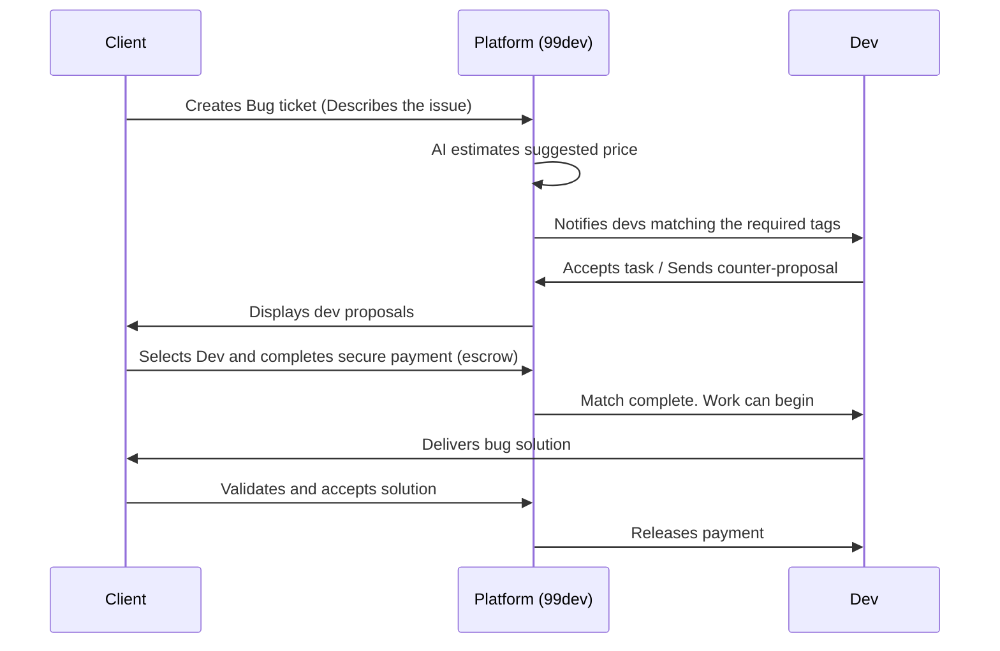

# 🚀 99dev

> **The "Uber" for real-time code corrections.** Connecting experienced developers with clients who have urgent bugs in production or broken code. Pay only for the resolved problem.

---

## 📋 Table of Contents

- [About the Project](#-about-the-project)
- [Features](#-features)
- [Tech Stack](#-tech-stack)
- [Project Structure](#-project-structure)
- [Getting Started](#-getting-started)
  - [Prerequisites](#prerequisites)
  - [Configuration and Startup](#configuration-and-startup)
- [Backend Endpoints](#-backend-endpoints)
- [Workflow (Match Sequence)](#-workflow-match-sequence)
- [Roadmap](#-roadmap)

---

## 💡 About the Project

**99dev** is a marketplace platform that functions similarly to ride-hailing apps (like Uber), but designed for software development.

- **For Clients:** Did a deploy break on Friday? Did a critical bug show up that your internal team can't resolve? Clients open a "rescue ticket", fill in the details, and the platform connects them to an available developer in minutes.
- **For Developers:** Developers can browse available "rides" (bugs), analyze tags and price estimates, send proposals, and start coding immediately, earning money quickly and flexibly.

---

## ✨ Features

### 👤 Client Area
- **Signup & Login:** Dedicated authentication pages.
- **Ticket Creation:** An intuitive form to describe the problem, paste error logs, and choose the technologies involved.
- **AI Estimation:** AI assistance to suggest a price range based on the bug's complexity.
- **Secure Payment (Escrow):** Funds are temporarily held by the platform and only released once the client validates and approves the fix.
- **Real-Time Tracking:** A tracking dashboard to monitor the developer's progress (from match to completion).

### 💻 Developer Area
- **Opportunity Dashboard:** A real-time feed displaying open bug "rides" currently available.
- **Smart Filters:** Filter bugs based on preferred languages and frameworks (e.g., React, Node.js, Next.js, CSS).
- **Proposals & Matching:** Submit bids and estimated resolution times.
- **Reputation & History:** A star-rating review system based on past fixes to build developer authority on the platform.

---

## 🛠️ Tech Stack

The project uses a modern architecture split into a conceptual monorepo (isolated frontend and backend):

### Frontend
- **Framework:** [Next.js 16](https://nextjs.org/) (App Router & React 19)
- **Styling:** [Tailwind CSS v4](https://tailwindcss.com/)
- **Animations:** [Framer Motion](https://www.framer.com/motion/)
- **Icons:** [Lucide React](https://lucide.dev/)
- **State Management:** [Zustand](https://zustand-demo.pmnd.rs/)
- **UI Components:** [Radix UI](https://www.radix-ui.com/) & [Shadcn UI](https://ui.shadcn.com/)
- **Form Validation:** [React Hook Form](https://react-hook-form.com/) & [Zod](https://zod.dev/)

### Backend
- **Framework:** [Fastify 5](https://fastify.dev/) (High-performance, low overhead, modular)
- **Language:** [TypeScript](https://www.typescriptlang.org/)
- **Development Tooling:** [tsx](https://github.com/privatenumber/tsx) (Fast TypeScript execution without manual pre-compilation during development)

---

## 📁 Project Structure

```bash
99dev/
├── backend/                  # API Server (Fastify + TypeScript)
│   ├── src/
│   │   ├── config/           # Environment configuration (env.ts)
│   │   ├── routes/           # Route modules (health, root, index)
│   │   ├── app.ts            # Fastify application setup
│   │   └── server.ts         # Server entry point
│   ├── package.json
│   └── tsconfig.json
│
└── frontend/                 # User Interface (Next.js + Tailwind v4)
    ├── app/                  # Page structure (Next.js App Router)
    │   ├── auth/             # Login and signup
    │   ├── create-ticket/    # Ticket creation
    │   ├── dashboard/        # Client and Developer dashboards
    │   ├── job/              # Individual job tracking and details
    │   └── layout.tsx & page.tsx
    ├── components/           # Reusable components
    │   ├── dashboard/        # Specific headers, sidebars, and trackers
    │   └── ui/               # Base UI components (buttons, cards, dialogs)
    ├── hooks/                # Custom React Hooks
    ├── lib/                  # Utility helpers (e.g. axios/fetch configs, cn helper)
    ├── styles/               # Global styles
    └── package.json
```

---

## 🚀 Getting Started

### Prerequisites

Make sure you have the following installed on your machine:
- **Node.js** (version 18 or higher)
- A package manager (preferably **pnpm** as there are lockfiles present in the directories, though you can use **npm** or **yarn**).

### Configuration and Startup

#### 1. Clone the repository
```bash
git clone https://github.com/Otavio-Emanoel/99dev.git
cd 99dev
```

#### 2. Start the Backend
Open a terminal in the backend directory:
```bash
cd backend
pnpm install
pnpm dev
```
The backend server runs at `http://localhost:3001` by default.

#### 3. Start the Frontend
Open another terminal in the frontend directory:
```bash
cd frontend
pnpm install
pnpm dev
```
The frontend application runs at `http://localhost:3000`. Open this URL in your web browser.

---

## 📡 Backend Endpoints

Currently, the backend includes the following entrypoints for initial verification:

- `GET /` - Returns a server welcome message.
- `GET /health` - Returns server health status and system information.

---

## 🔄 Workflow (Match Sequence)



---

## 🗺️ Roadmap

- [ ] **Data Persistence:** Database integration (PostgreSQL using Prisma ORM or Drizzle).
- [ ] **Real-Time Communication:** WebSockets integration (Fastify Socket.io or native WebSockets) for instant dev notifications when a new bug is posted, and developer-client chat.
- [ ] **Payment Gateway:** Integration with Stripe or Pix with temporary escrow retention.
- [ ] **Sandbox / Validator:** Internal tool or cloud sandbox environment enabling clients to test the bug resolution in a secure container before releasing funds.
