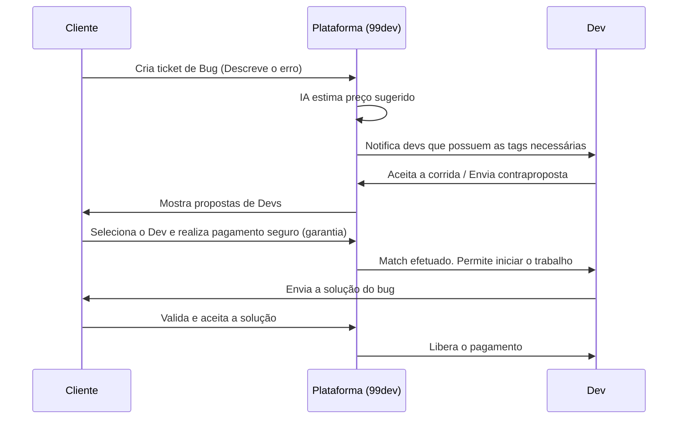

# 🚀 99dev

> **O "Uber" para correções de código em tempo real.** Conectando desenvolvedores experientes a clientes com bugs urgentes em produção ou códigos quebrados. Pague apenas pelo problema resolvido.

---

## 📋 Índice

- [Sobre o Projeto](#-sobre-o-projeto)
- [Funcionalidades](#-funcionalidades)
- [Tecnologias Utilizadas](#-tecnologias-utilizadas)
- [Estrutura do Projeto](#-estrutura-do-projeto)
- [Como Executar o Projeto](#-como-executar-o-projeto)
  - [Pré-requisitos](#pré-requisitos)
  - [Configuração e Inicialização](#configuração-e-inicialização)
- [Endpoints do Backend](#-endpoints-do-backend)
- [Fluxo de Funcionamento (Match)](#-fluxo-de-funcionamento-match)
- [Roadmap de Evolução](#-roadmap-de-evolução)

---

## 💡 Sobre o Projeto

O **99dev** é uma plataforma marketplace que funciona de maneira semelhante a aplicativos de corrida (como o Uber), mas voltada para o desenvolvimento de software. 

- **Para Clientes:** Um deploy falhou na sexta-feira? Um bug crítico apareceu e a equipe interna não consegue resolver? O cliente abre um "ticket de socorro", define os detalhes, e a plataforma o conecta a um desenvolvedor disponível em minutos.
- **Para Desenvolvedores:** Desenvolvedores podem encontrar "corridas" (bugs) disponíveis, analisar as tags e a estimativa de preço, enviar propostas e começar a codar imediatamente, ganhando dinheiro de forma ágil e flexível.

---

## ✨ Funcionalidades

### 👤 Área do Cliente
- **Cadastro & Login:** Autenticação dedicada.
- **Criação de Tickets:** Formulário intuitivo para descrever o problema, anexar logs, e escolher tecnologias.
- **Estimativa por IA:** Assistência para sugerir uma faixa de preço com base na complexidade do bug.
- **Pagamento Seguro (Escrow):** O valor fica retido na plataforma e só é liberado após a validação e confirmação da solução pelo cliente.
- **Acompanhamento em Tempo Real:** Tela de tracking para ver o progresso do desenvolvedor (do match à entrega).

### 💻 Área do Desenvolvedor
- **Painel de Oportunidades:** Lista em tempo real com "corridas" de bugs abertas no mercado.
- **Filtros Inteligentes:** Seleção de bugs baseada nas linguagens e frameworks de preferência do desenvolvedor (ex: React, Node.js, Next.js, CSS).
- **Proposta & Match:** Envio de lances e tempo estimado para resolução.
- **Reputação & Histórico:** Sistema de avaliação por estrelas baseado em soluções anteriores para construir autoridade na plataforma.

---

## 🛠️ Tecnologias Utilizadas

O projeto adota uma arquitetura moderna dividida em um monorepositório conceitual (frontend e backend isolados):

### Frontend
- **Framework:** [Next.js 16](https://nextjs.org/) (App Router & React 19)
- **Estilização:** [Tailwind CSS v4](https://tailwindcss.com/)
- **Animações:** [Framer Motion](https://www.framer.com/motion/)
- **Ícones:** [Lucide React](https://lucide.dev/)
- **Gerenciamento de Estado:** [Zustand](https://zustand-demo.pmnd.rs/)
- **Componentes de UI:** [Radix UI](https://www.radix-ui.com/) & [Shadcn UI](https://ui.shadcn.com/)
- **Validação de Formulários:** [React Hook Form](https://react-hook-form.com/) & [Zod](https://zod.dev/)

### Backend
- **Framework:** [Fastify 5](https://fastify.dev/) (Rápido, de baixo overhead e modular)
- **Linguagem:** [TypeScript](https://www.typescriptlang.org/)
- **Desenvolvimento:** [tsx](https://github.com/privatenumber/tsx) (Execução rápida TypeScript sem compilação prévia no dev mode)

---

## 📁 Estrutura do Projeto

```bash
99dev/
├── backend/                  # Servidor de API (Fastify + TypeScript)
│   ├── src/
│   │   ├── config/           # Configurações de ambiente (env.ts)
│   │   ├── routes/           # Módulos de rotas (health, root, index)
│   │   ├── app.ts            # Inicialização do Fastify
│   │   └── server.ts         # Ponto de entrada do servidor
│   ├── package.json
│   └── tsconfig.json
│
└── frontend/                 # Interface do Usuário (Next.js + Tailwind v4)
    ├── app/                  # Estrutura de páginas (Next.js App Router)
    │   ├── auth/             # Login e cadastro
    │   ├── create-ticket/    # Criação de novos tickets
    │   ├── dashboard/        # Painéis do usuário/dev
    │   ├── job/              # Visualização e tracking de jobs individuais
    │   └── layout.tsx & page.tsx
    ├── components/           # Componentes reutilizáveis
    │   ├── dashboard/        # Headers, sidebar e trackers específicos
    │   └── ui/               # Componentes visuais base (botões, cards, dialogs)
    ├── hooks/                # Custom React Hooks
    ├── lib/                  # Utilitários (ex: setup do axios/fetch, cn helper)
    ├── styles/               # Estilizações globais
    └── package.json
```

---

## 🚀 Como Executar o Projeto

### Pré-requisitos

Certifique-se de ter instalado em sua máquina:
- **Node.js** (versão 18 ou superior)
- Um gerenciador de pacotes (preferencialmente **pnpm** devido aos arquivos de lock existentes no projeto, mas você também pode usar **npm** ou **yarn**).

### Configuração e Inicialização

#### 1. Clonar o repositório
```bash
git clone https://github.com/Otavio-Emanoel/99dev.git
cd 99dev
```

#### 2. Executar o Backend
Abra um terminal na pasta do backend:
```bash
cd backend
pnpm install
pnpm dev
```
O backend iniciará em `http://localhost:3001` por padrão.

#### 3. Executar o Frontend
Abra outro terminal na pasta do frontend:
```bash
cd frontend
pnpm install
pnpm dev
```
O frontend iniciará em `http://localhost:3000`. Acesse no seu navegador.

---

## 📡 Endpoints do Backend

Atualmente, o backend conta com os seguintes endpoints de verificação e testes iniciais:

- `GET /` - Retorna a mensagem de boas-vindas do servidor.
- `GET /health` - Retorna o status de integridade do servidor e informações do sistema.

---

## 🔄 Fluxo de Funcionamento (Match)



---

## 🗺️ Roadmap de Evolução

- [ ] **Persistência de Dados:** Integração com Banco de Dados Relacional (PostgreSQL via Prisma ORM ou Drizzle).
- [ ] **Comunicação em Tempo Real:** Integração de WebSockets (Fastify Socket.io ou WebSockets nativos) para notificar instantaneamente os devs quando um bug novo surgir e para o chat de atendimento cliente-dev.
- [ ] **Gateway de Pagamento:** Integração de pagamentos usando Stripe ou Pix com retenção temporária de fundos.
- [ ] **Sandbox / Validador:** Ferramenta interna ou integração com ambiente cloud para o cliente testar a resolução do bug em um container seguro antes de liberar o pagamento.
